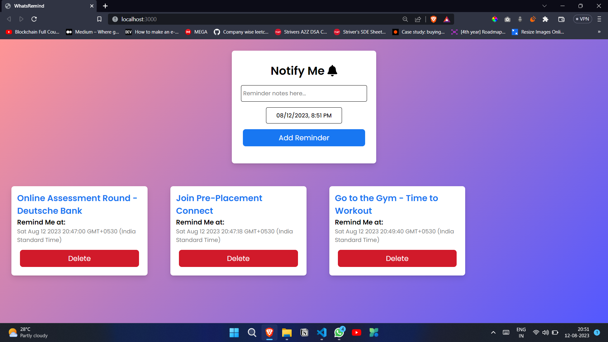
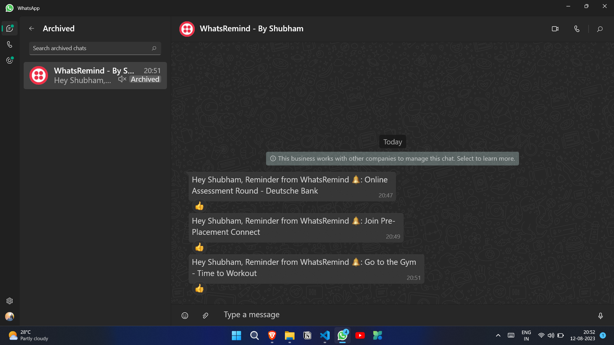

# WhatsRemind - MERN App

Schedule reminders for specific date &amp; time and get notified on WhatsApp.

## Screenshots

## How to use

**Installation:** Clone the repository and navigate to the project folder. Run npm install to install all the necessary dependencies for the frontend and backend.

**Database Configuration:** Set up a MongoDB database and update the connection details in the backend configuration.

**Environment Variables:** Create a .env file in the backend directory to up environment variables

**Twilio API:** Get AUTH_TOKEN and ACCOUNT_SID from https://www.twilio.com/console. Put them in .env file, don't forget to set your WhatsApp number in the index.js (Node.js) file.

**Run the Application:** In separate terminal windows, run npm start for the frontend and backend to start the application.

**Access the App:** Open your web browser and go to http://localhost:3000 to access the app.
Set reminders for your tasks and get notified at that time!

## Tech Stack

**Client:** React, HTML, CSS

**Server:** Node, Express, MongoDB

MongoDB: A NoSQL database used to store task data and user information securely.

Express.js: A web application framework for Node.js used to build the backend API.

React.js: A popular JavaScript library for building user interfaces, used to create the frontend of the app.

Node.js: A runtime environment that allows running JavaScript on the server side.

Twilio API: Integrated for sending WhatsApp notifications and reminders to users.

## Support

For support, email contactshubhamparmar@gmail.com

## Authors

- [@ishubhamparmar](https://www.github.com/ishubhamparmar)

# Hi, I'm Shubham Parmar! 👋

## 🚀 About Me

I'm a pre-final year Computer Science Engineering undergrad @ RGPV Bhopal. Currently Polishing DSA, Problem Solving and Web Development Skills.

## 🛠 Skills

Node.js, MongoDB, Java, Javascript, HTML, CSS...

## 🔗 Links

